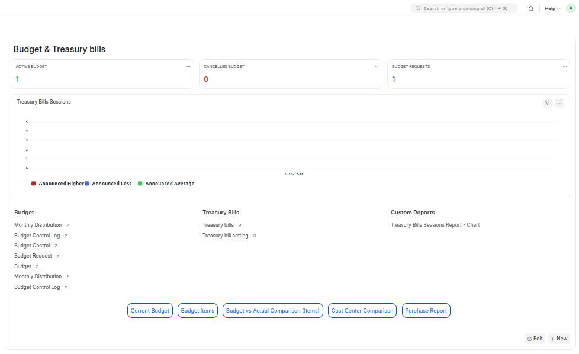
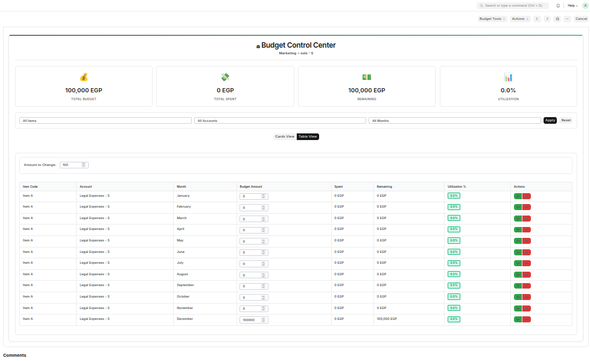
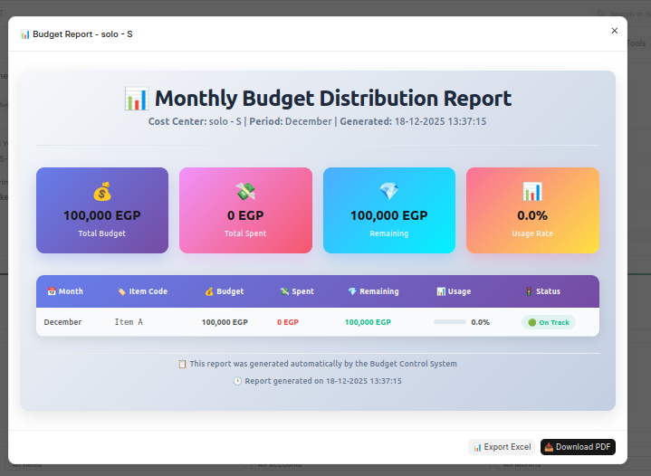
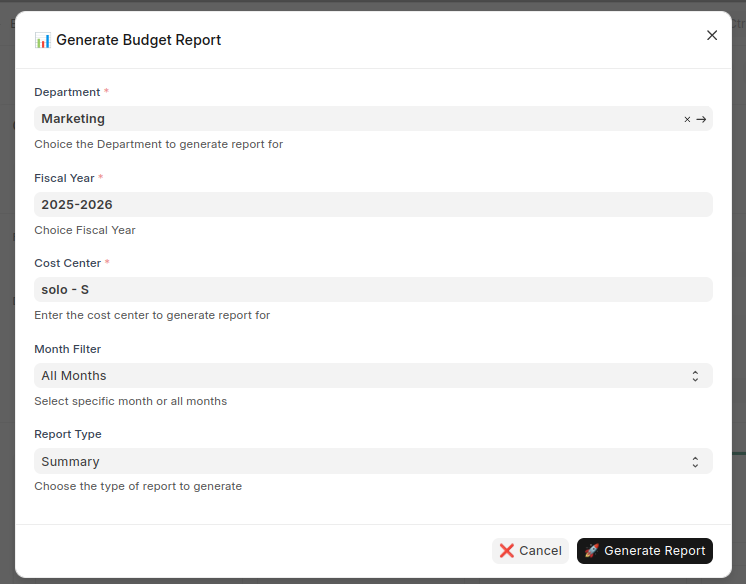
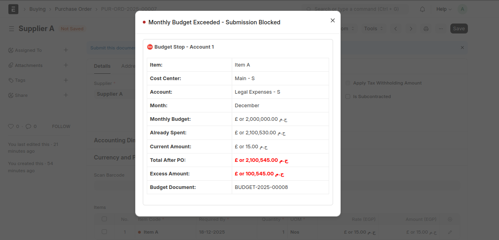
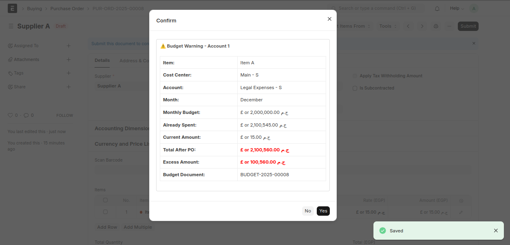
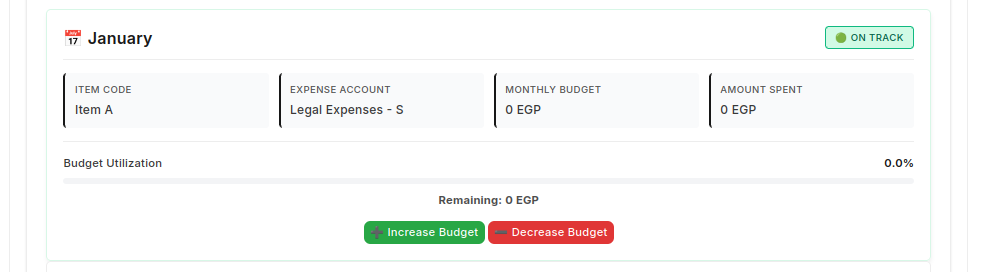

<div align="center">
    <h1 style="font-size: 36px; color: white; font-weight: bold; margin-bottom:15px">Budget Control Management</h1>
</div>


<table>
  <tr>
    <td align="center" width="50%">
      <b> WorkSpace</b><br>
      
    </td>
    <td align="center" width="50%">
      <b> Table View</b><br>
      
    </td>
  </tr>
  <tr>
    <td align="center" width="50%">
      <b> Export Monthly Budget</b><br>
      
    </td>
    <td align="center" width="50%">
      <b>Dialog Filters to Export Your Data</b><br>
      
    </td>
  </tr>
</table>


## Installation

1. Get the app:
   ```bash
   bench get-app https://github.com/AhmedAbokhatwa/budget-management-system.git
2. Navigate to the apps directory:
    ```bash
    mv budget-management-system/ budget
3. Install the app on your site:
    ```bash
    bench --site your-site-name install-app budget

# 📊 Budget Control Dashboard

---

## Overview

# Budget Management System

A comprehensive budget management feature for ERPNext that provides monthly budget distribution and real-time budget tracking with configurable actions when limits are exceeded.

---

## ✨ Key Features & 🏆 Benefits

### **Automatic Monthly Allocation**
```
Split annual budgets across months automatically.
- Divide yearly budget into 12 equal monthly portions
- Automatic calculation and distribution
- Adjustable monthly allocations
```

### **Control Screen**
```
┌─────────────────────────────────────────┐
│  Budget Control Panel                   │
│  ├─ Adjust (Increase/Decrease) monthly  │
│  ├─ Advanced Filters:                   │
│  │  ├─ By Item                          │
│  │  ├─ By Cost Center                   │
│  │  └─ By Expense Account               │
│  └─ Real-time Budget Tracking           │
└─────────────────────────────────────────┘
```

### **Purchase Order Validation**
```
Control overspending with Stop or Warning messages
before submission when Purchase Order limits are exceeded.

- Validate against monthly budget limit
- Prevent overspending automatically
- Configurable action (Stop/Warn)
```

### **Powerful Reporting**
```
Export budget reports anytime to PDF or Excel
for analysis and sharing.

- Generate comprehensive reports
- Multiple export formats
- Custom date ranges
- Department-wise analysis
```

### **Cascading Deletion (Sequential Delete)**
```
Maintain clean data by ensuring related records
are deleted in sequence.

- Delete dependent records automatically
- Maintain data integrity
- Track deletion history
```

### **Budget Control Log**
```
Track every adjustment (increase/decrease) with
a full audit trail for transparency.

- Complete audit trail
- All modifications tracked
- User attribution
- Timestamp recording
```

---
## 🎬 Demo Video

Check out the demo of **Budget Control Center**:

[](https://youtu.be/6kc_sskH9Es?si=Ch9IMaZKkkGsiD8r)

---

## How It Works

### Complete Workflow Scenario

Step 1: Create Budget Control

    ┌─────────────────────────────────────────────────────┐
    │  Create Budget Control Document                     │
    ├─────────────────────────────────────────────────────┤
    │  (Name): Budget Control-2025-Marketing              │
    │  ├─ Department: Marketing                           │
    │  ├─ Fiscal Year: 2025                               │
    │  ├─ Cost Center: Marketing                          │
    │  └─ Status: Active                                  │
    └─────────────────────────────────────────────────────┘
            │
            │ (Submit Budget Control) -> Budget Control-2025-Marketing
            ↓
        ✅ Ready for Budget Requests

Step 2: Create Budget Request

    ┌───────────────────────────────────────────────────────────┐
    │  Create Budget Request Document                           │
    ├───────────────────────────────────────────────────────────┤
    │  (Name): BR-Marketing-2025-09                             │
    │  ├─ Department: Marketing                                 │
    │  ├─ Fiscal Year: 2025                                     │
    │  ├─ Cost Center: Marketing                                │
    │  ├─ Budget Control: Budget Control-2025-Marketing         │
    │  └─ Status: Draft                                         │
    │                                                           │
    │  📋 Budget Items Details:                                 │
    │  ├─ Item Code: ITEM A                                     │
    │  ├─ Expected Price: 100.00 SAR                            │
    │  ├─ Expense Account: Marketing Expenses - S               │
    │  └─ Monthly Quantities:                                   │
    │      ├─ Jan: 100 Qty                                      │
    │      ├─ Feb: 100 Qty                                      │
    │      ├─ ... (continuing)                                  │
    │      └─ Dec: 100 Qty                                      │
    └───────────────────────────────────────────────────────────┘
        │
        │ (Submit Budget Request) -> BR-Marketing-2025-09
        ↓
    ✅ Triggers Automatic Creation

Step 3: Auto-Generated Budget Document

        ┌─────────────────────────────────────────────────────┐
        │  Budget Document (Auto-Created)                     │
        ├─────────────────────────────────────────────────────┤
        │  Name: BUDGET-2025-01                               │
        │  ├─ Budget Control: Budget Control-2025-Marketing   │
        │  ├─ Cost Center: Marketing                          │
        │  ├─ Fiscal Year: 2025                               │
        │  ├─ Budget Request Ref: BR-Marketing-2025-09        │
        │  ├─ Action if Budget Exceeded: Stop (0) / Warn (1)  │
        │  │                                                  │
        │  └─ Budget Accounts Table:                          │
        │      ├─ Account: Marketing Expenses - S             │
        │      ├─ Item Code: ITEM A                           │
        │      ├─ Budget Amount: 10,000 SAR                   │
        │      └─ Monthly Distribution: Auto-assigned         │
        │          (BR-Mkt-2025-09-Marketing Expenses-S)      │
        └─────────────────────────────────────────────────────┘
            │
            │ (Auto-creates Monthly Distribution)
            ↓
        ✅ Ready for Enforcement


Step 4: Auto-Generated Monthly Distribution

    ┌─────────────────────────────────────────────────────┐
    │  Monthly Distribution Document (Auto-Created)       │
    ├─────────────────────────────────────────────────────┤
    │  Name: BR-Marketing-2025-09-Marketing Expenses-S    │
    │                                                     │
    │  Configuration:                                     │
    │  ├─ Item Code: ITEM A                               │
    │  ├─ Cost Center: Marketing                          │
    │  ├─ Budget Control: Budget Control - 2025 - Mkt     │
    │  ├─ Fiscal Year: 2025                               │
    │  ├─ Expense Account: Marketing Expenses - S         │
    │  ├─ Budget: BUDGET-2025-01                          │
    │  ├─ Department: Marketing                           │
    │  │                                                  │
    │  └─ 📊 Monthly Distribution Percentages:            │
    │      ├─ Month: January    │ Amount: 833.33 SAR      │
    │      ├─ Month: February   │ Amount: 833.33 SAR      │
    │      ├─ Month: March      │ Amount: 833.33 SAR      │
    │      ├─ ... (continuing equally)                    │
    │      └─ Month: December   │ Amount: 833.33 SAR      │
    │         ────────────────────────────────────────    │
    │         TOTAL: 10,000 SAR (12 months × 833.33)      │
    └─────────────────────────────────────────────────────┘

# ** test Case **

# Step 5: Create Purchase Order (Within Budget)

    ┌─────────────────────────────────────────────────────┐
    │  Create Purchase Order                              │
    ├─────────────────────────────────────────────────────┤
    │  Month: December (Month 12)                         │
    │  ├─ Item Code: ITEM A                               │
    │  ├─ Expense Account: Marketing Expenses - S         │
    │  ├─ Cost Center: Marketing                          │
    │  ├─ Amount: 833.33 SAR                              │
    │  └─ Status: Draft                                   │
    └─────────────────────────────────────────────────────┘
                │
                │ (Submit Purchase Order)
                │ Triggers Budget Validation
                ↓
    ┌─────────────────────────────────────────────────────┐
    │  Budget Validation Check                            │
    ├─────────────────────────────────────────────────────┤
    │  ✅ December Budget Status:                         │
    │  ├─ Monthly Limit: 833.33 SAR                       │
    │  ├─ Already Spent: 0 SAR                            │
    │  ├─ Available Balance: 833.33 SAR                   │
    │  ├─ Request Amount: 833.33 SAR                      │
    │  │                                                  │
    │  └─ Validation: 833.33 ≤ 833.33 ✅ APPROVED         │
    └─────────────────────────────────────────────────────┘
                │
                ↓
    ┌─────────────────────────────────────────────────────┐
    │  System Action                                      │
    ├─────────────────────────────────────────────────────┤
    │  ✅ Allow Transaction                               │
    │  ├─ Status: SUBMITTED                               │
    │  ├─ Update Budget Balance: 0 SAR remaining          │
    │  ├─ Log Transaction in Audit Trail                  │
    │  └─ Notify User: PO Successfully Created            │
    └─────────────────────────────────────────────────────┘
    Result: ✅ APPROVED - Purchase Order submitted successfully

Step 6: Create Purchase Order (Exceeds Budget)

        ┌─────────────────────────────────────────────────────┐
        │  Create Purchase Order                              │
        ├─────────────────────────────────────────────────────┤
        │  Month: December (Month 12)                         │
        │  ├─ Item Code: ITEM A                               │
        │  ├─ Expense Account: Marketing Expenses - S         │
        │  ├─ Cost Center: Marketing                          │
        │  ├─ Amount: 10,001 SAR  ⚠️ (Exceeds limit)          │
        │  └─ Status: Draft                                   │
        └─────────────────────────────────────────────────────┘
            │
            │ (Submit Purchase Order)
            │ Triggers Budget Validation
            ↓
        ┌─────────────────────────────────────────────────────┐
        │  Budget Validation Check                            │
        ├─────────────────────────────────────────────────────┤
        │  ❌ December Budget Status:                         │
        │  ├─ Monthly Limit: 833.33 SAR                       │
        │  ├─ Already Spent: 0 SAR                            │
        │  ├─ Available Balance: 833.33 SAR                   │
        │  ├─ Request Amount: 10,001 SAR                      │
        │  ├─ Exceeded Amount: 9,167.67 SAR                   │
        │  │                                                  │
        │  └─ Validation: 10,001 > 833.33 ❌ EXCEEDS          │
        └─────────────────────────────────────────────────────┘
            │
            │ Check Configuration
            ↓
        ┌──────────────────────────────────────┐
        │  Action if Budget Exceeded Setting   │
        │  ├─ 0 = Stop (Block Transaction)     │
        │  └─ 1 = Warn (Allow with Alert)      │
        └──────────────────────────────────────┘
            │
            ├─────────────────┬────────────────────┐
            │                 │                    │
          (Stop)             (Warn)              (ignore)
            │                 │
            ↓                 ↓
        ┌─────────────────────────────────────────────────────┐
        │  Action 0: STOP MODE                                │
        ├─────────────────────────────────────────────────────┤
        │  🚫 TRANSACTION BLOCKED                             │
        │  ├─ Error Message:                                  │
        │  │  "Budget limit exceeded for December!            │
        │  │   Monthly Budget: 833.33 SAR                     │
        │  │   Requested: 10,001 SAR                          │
        │  │   Exceeded by: 9,167.67 SAR                      │
        │  │   Contact Finance Manager"                       │
        │  │                                                  │
        │  ├─ Status: BLOCKED                                 │
        │  ├─ Cannot Submit PO                                │
        │  ├─ Require Budget Override Approval                │
        │  └─ Log: Blocked attempt recorded                   │
        └─────────────────────────────────────────────────────┘
        Result: ❌ BLOCKED - Budget limit exceeded

        Alternative: WARN MODE

        ┌─────────────────────────────────────────────────────┐
        │  Action 1: WARN MODE                                │
        ├─────────────────────────────────────────────────────┤
        │  ⚠️ WARNING MESSAGE DISPLAYED                       │
        │  ├─ Alert:                                          │
        │  │  "⚠️ WARNING: Budget limit will be exceeded!     │
        │  │   Monthly Budget: 833.33 SAR                     │
        │  │   Requested: 10,001 SAR                          │
        │  │   Would exceed by: 9,167.67 SAR                  │
        │  │   Continue anyway?"                              │
        │  │                                                  │
        │  ├─ User Options:                                   │
        │  │  ├─ [CONTINUE] - Allow with warning logged       │
        │  │  └─ [CANCEL] - Stop and revise amount            │
        │  │                                                  │
        │  ├─ Status: ALLOWED WITH ALERT                      │
        │  ├─ Can Submit PO (with warning recorded)           │
        │  └─ Log: Override warning documented                │
        └─────────────────────────────────────────────────────┘
                                    │
                                    ↓
        ┌─────────────────────────────────────────────────────┐
        │  System Action (If Continued)                       │
        ├─────────────────────────────────────────────────────┤
        │  ⚠️ Allow Transaction                               │
        │  ├─ Status: SUBMITTED (with warning flag)           │
        │  ├─ Update Budget Balance: -9,167.67 (OVER)         │
        │  ├─ Send Alert to Finance Manager                   │
        │  ├─ Log: Over-budget transaction recorded           │
        │  └─ Flag: Requires manual review                    │
        └─────────────────────────────────────────────────────┘
        Result: ⚠️ WARNING - Allowed but flagged for review


# 1- **Configuration Options**
**Budget Actions**
<table>
  <tr>
    <td align="center" width="50%">
      <b> Stop </b><br>
      
    </td>
    <td align="center" width="50%">
      <b> Warn</b><br>
      
    </td>
  </tr>
</table>

```
Configure system behavior when monthly budgets are exceeded:
```
- `Action if Monthly Budget Exceeded on Purchase Order = Stop`
- `Action if Monthly Budget Exceeded on Purchase Order = Warn`

---

# 2- **Control Options**
**Control Month Budget**



Press **Increase** or **Decrease** to adjust the monthly allocation.

---

# 3- **Control Logs**
Every increase or decrease of the monthly budget will create a log record in the **Budget Control Log** Doctype for full audit and tracking.

---

**Made with ❤️ for Better Budget Management**

#ERPNext #FrappeFramework #BudgetManagement #FinancialControl #CrownCode #TechSolution #DigitalTransformation #AppDevelopment #BusinessIntelligence


## Frappe Cloud / Non-Developer Mode Compatibility
This app is packaged as a **standard Frappe app** (DocTypes live in the app code). It does **not** ship DocTypes as fixtures, so it can be installed on Frappe Cloud without enabling developer mode.

## AI Copilot (Configurable)
1. Go to **AlphaX Budget Settings**.
2. Enable **Enable AI Copilot**.
3. Set an **OpenAI-compatible** endpoint + API key + model.
4. Open **AlphaX Budget Copilot** from the Desk and ask questions.

> If AI Provider is set to **None**, the Copilot will return a safe guidance template.
